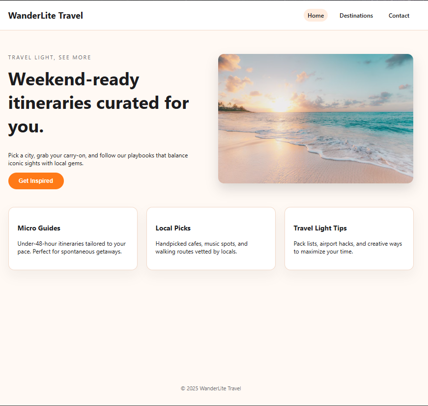
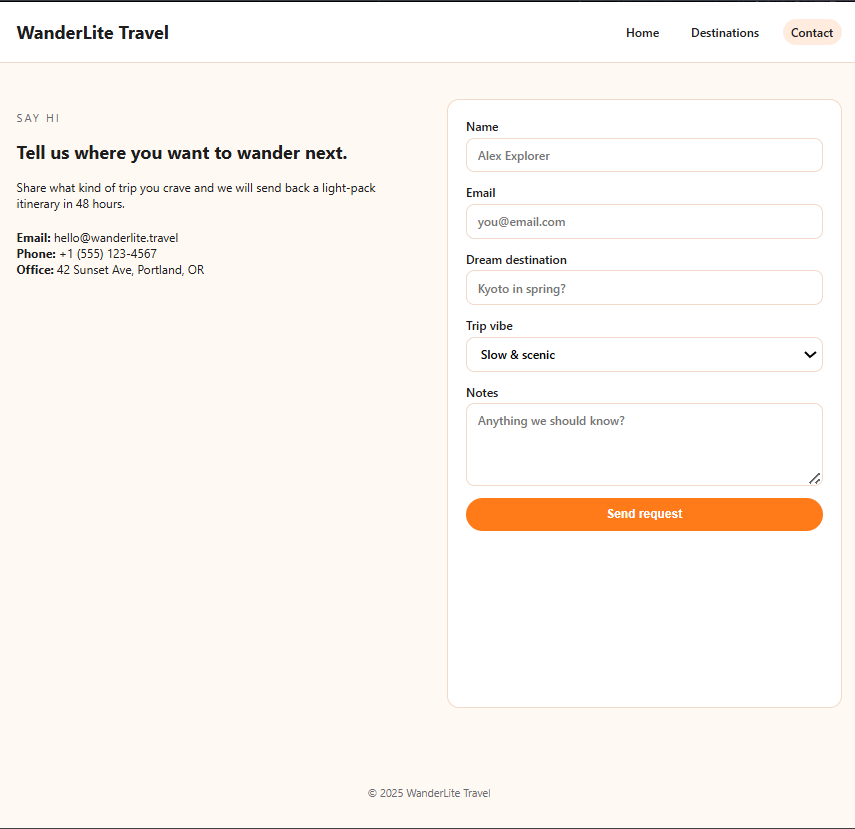

# Weekend Itinerary Site

Simple three-page travel concept to showcase clean HTML/CSS/JS, responsive layouts, and a pinch of interactivity. Some of this project was made using AI assistance.

## Pages
- **Home (`index.html`)** – Hero pitch plus feature cards explaining the WanderLite concept.
- **Destinations (`destinations.html`)** – Grid of curated micro-guides for three cities.
- **Contact (`contact.html`)** – Contact info and a lightweight form that simulates sending a request.

## Tech Stack
- Plain HTML for structure.
- One shared `style.css` for typography, layout grids, and CTA styling.
- One shared `script.js` for nav highlighting, hero button feedback, and mock form handling.

## Getting Started
1. Clone the repo:  
   `git clone https://github.com/<your-handle>/weekend-itinerary-site.git`
2. Open `index.html` in your browser (double-click or drag into a window).
3. Optional: run a live-reload server (e.g., VS Code **Live Server** extension) for faster iteration.

## Screenshots

  
  
  

